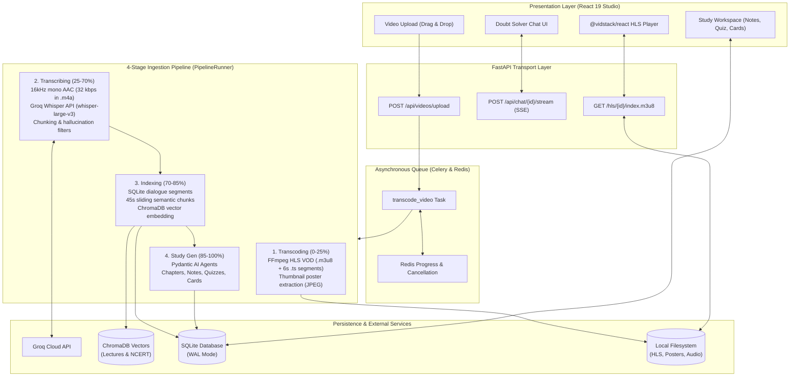

# Doubtless

> **An interactive video lecture platform providing real-time, playhead-synchronized AI doubt resolution, dual-source vector RAG, and automated study workspaces.**

[](https://python.org)
[](https://fastapi.tiangolo.com)
[](https://react.dev)
[](https://vitejs.dev)
[](https://tailwindcss.com)
[](https://docs.celeryq.dev)
[](https://trychroma.com)
[](https://groq.com)
[](https://logfire.pydantic.dev)
[](https://mypy-lang.org)
[](https://github.com/astral-sh/ruff)
[]()

---

## Overview

Traditional recorded video lectures are passive and unidirectional. When students get stuck on an equation or concept at timestamp `14:32`, they must pause, leave the video player, search external forums, lose their flow, or wait for office hours.

**Doubtless transforms passive video consumption into an active, context-aware learning workspace:**
1. **Playhead-Grounded Doubt Solving**: Students ask questions at any point in the video. The system captures the temporal dialogue window immediately surrounding the current playhead timestamp (e.g., *"What is this equation on the screen?"* or *"Why did the teacher divide by zero here?"*).
2. **Dual-Grounded RAG Engine**: Combines the instructor's spoken dialogue with official textbook knowledge (NCERT science and math indices) via vector search (`Qwen3-Embedding-0.6B` + cosine similarity in ChromaDB) and bilingual query expansion (Hindi/Hinglish/English).
3. **Automated Study Artifact Generation**: Transforms raw lecture speech into interactive Markdown study notes, timestamped topic chapters with direct video seeking, multiple-choice quizzes with explanations, and spaced-repetition flashcards.
4. **Adaptive HLS Streaming**: Transcodes video into multi-segment HTTP Live Streaming (HLS VOD) playlists for instant seeking and responsive playback across devices.

---

## System Architecture



---

## Core Features

### 1. Intelligent Doubt Solver (RAG Agent)

```mermaid
sequenceDiagram
    autonumber
    actor Student as Student (Playhead @ 14:32)
    participant UI as React 19 Studio
    participant API as FastAPI Chat Stream
    participant Svc as ChatService & Agent
    participant SQLite as SQLite DB
    participant Chroma as ChromaDB Vector Store
    participant LLM as LLM (NineRouter)

    Student->>UI: "Why did we divide by zero here?"
    UI->>API: POST /api/chat/{video_id}/stream (query + playhead_seconds=872.0)
    API->>Svc: chat_stream(video_id, query, playhead_seconds)
    Svc->>SQLite: get_transcript_segments_window(872.0, before=60s, after=15s)
    SQLite-->>Svc: Spoken dialogue window [-60s ... +15s]
    
    rect rgb(20, 24, 39)
        Note over Svc,Chroma: Dual-Source RAG Tool Calls
        Svc->>LLM: Bilingual query expansion (Hinglish/Hindi -> Concepts)
        LLM-->>Svc: Expanded search terms
        Svc->>Chroma: search_lecture(video_id, expanded_query)
        Chroma-->>Svc: Top lecture dialogue chunks
        Svc->>Chroma: search_books(expanded_query)
        Chroma-->>Svc: NCERT textbook formulas & theorems
    end

    Svc->>LLM: Prompt with playhead context + retrieved textbook passages
    LLM-->>API: Stream token chunks
    API-->>UI: Server-Sent Events (SSE) stream
    UI-->>Student: Render markdown answer + seekable timestamp links
```



- **Temporal Playhead Grounding**: Injects dialogue from a window of `-60s` to `+15s` relative to the current video playhead. The agent immediately understands deictic references (*"this derivation"*, *"the term on the right"*).
- **Dual-Domain Knowledge Retrieval**:
  - `search_lecture`: Searches the specific video's spoken dialogue chunks in ChromaDB.
  - `search_books`: Searches canonical NCERT STEM textbook passage vectors to verify definitions, theorems, and formulas.
  - `get_chapter_notes`: Reads high-level chapter outlines to ground questions within the overall lecture syllabus.
- **Bilingual Query Expansion**: Employs an LLM expansion step that rewrites student queries in Hinglish/Hindi into standardized conceptual search phrases across both languages before vector embedding.
- **Real-Time Streaming**: Delivers answers token-by-token over HTTP Server-Sent Events (SSE) using Starlette `EventSourceResponse`.

### 2. Monotonic 4-Stage Ingestion Pipeline
Coordinated by `PipelineRunner` (`src/doubtless/media/pipeline.py`) across four progressive stages:
1. **Transcoding (0% – 25%)**: FFprobe container validation, poster frame extraction, and multi-segment HLS VOD packaging (`libx264 -preset veryfast`, 6-second independent GOP segments).
2. **Transcribing (25% – 70%)**: 16kHz mono AAC extraction at 32 kbps (compressing 1-hour audio to ~14.4 MB). Cloud inference via Groq Whisper API (`whisper-large-v3`) with 10-minute chunking for large files, timestamp offsetting, and anti-hallucination filtering.
3. **Indexing (70% – 85%)**: Relational dialogue storage in SQLite, 45-second sliding window chunk aggregation, and vector embedding into ChromaDB using `Qwen3-Embedding-0.6B`.
4. **Study Generation (85% – 100%)**: Concurrent execution of Pydantic AI agents producing structured topic chapters, Markdown notes, quizzes, and flashcards.

### 3. Automated Interactive Study Workspace
- **Topic Chapters**: Timestamped navigation markers allowing students to jump directly to specific sub-topics in the video.
- **Lecture Notes**: Comprehensive Markdown summaries formatted with mathematical formulas, core concepts, and key definitions.
- **Interactive Quiz Engine**: Practice questions with instant answer feedback, option validation, and pedagogical rationale.
- **Spaced-Repetition Flashcards**: Interactive 3D flip-cards for rapid concept recall.

### 4. Enterprise Observability & Reliability
- **Distributed Tracing**: OpenTelemetry instrumentation integrated with Logfire across FastAPI routes, Celery background tasks, Redis, SQLite, and external HTTP clients.
- **HLS Static Cache Control**: Custom `HLSStaticFiles` server enforcing `Cache-Control: public, max-age=31536000, immutable` on video transport stream segments (`.ts`) and `no-cache` on live manifest playlists (`.m3u8`).
- **Cooperative Cancellation**: Pipeline tasks periodically poll Redis cancellation flags and SQLite state, cleanly tearing down partial HLS directories, vector embeddings, and database records via multi-layer cascade delete.
- **Non-Root Execution**: Dockerized with dedicated non-privileged user (`doubtless`, UID 1000) and automated volume permission alignment.

---

## Core API Endpoints

| Method | Endpoint | Description |
|---|---|---|
| `POST` | `/api/videos/upload` | Chunked multipart video file upload (up to 4 GB). Spawns Celery task. |
| `GET` | `/api/videos` | List all processed videos with status, duration, and thumbnail URLs. |
| `GET` | `/api/videos/{id}` | Retrieve specific video metadata and ready status. |
| `GET` | `/api/videos/{id}/status` | Real-time Redis pipeline progress polling (`stage`, `progress`, `message`). |
| `DELETE` | `/api/videos/{id}` | Multi-layer cascade deletion (DB, ChromaDB vectors, Redis, files). |
| `POST` | `/api/chat/{id}/stream` | **Server-Sent Events (SSE)** token streaming doubt resolution with playhead context. |
| `GET` | `/api/chat/{id}/messages` | Retrieve conversation history for a video session. |
| `DELETE` | `/api/chat/{id}/messages` | Clear chat history for a video. |
| `GET` | `/api/study/{id}/chapters` | Fetch timestamped topic chapters with video seek targets. |
| `GET` | `/api/study/{id}/notes` | Fetch comprehensive Markdown lecture notes. |
| `GET` | `/api/study/{id}/quiz` | Fetch generated multiple-choice quiz questions with answer rationale. |
| `GET` | `/api/study/{id}/flashcards` | Fetch spaced-repetition flashcards. |
| `GET` | `/hls/{id}/index.m3u8` | Serve HLS VOD playlist manifest. |
| `GET` | `/api/health` | Health check endpoint reporting API and database connectivity. |

---

## Tech Stack & Architecture Design

| Layer | Technology | Rationale & Responsibility |
|---|---|---|
| **Language Runtime** | Python 3.14+ | Utilizing modern Python typing, performance improvements, and Astral's `uv` for fast dependency resolution. |
| **API Framework** | FastAPI + Uvicorn | Asynchronous presentation layer, dependency injection, and SSE streaming. |
| **Task Queue** | Celery + Redis | Decouples heavy FFmpeg transcoding and AI generation from the HTTP request cycle. |
| **Speech-to-Text** | Groq Whisper API | High-throughput cloud inference (`whisper-large-v3`) processing a 1-hour lecture in ~15-20s without requiring dedicated local GPU hardware. |
| **Agent Framework** | Pydantic AI | Type-safe, structured LLM agents with explicit tool calling and system prompts. |
| **Vector Database** | ChromaDB | Embedded vector storage with cosine distance metric for lecture chunks and textbook passages. |
| **Embedding Model** | `Qwen/Qwen3-Embedding-0.6B` | Token-efficient 1024-dimension bilingual embeddings running efficiently on CPU or CUDA. |
| **Relational Storage** | SQLite (WAL mode) | Embedded, zero-configuration relational storage with Write-Ahead Logging and Foreign Key cascade enforcement. |
| **Media Engine** | FFmpeg / FFprobe | Hardware-independent audio extraction, HLS VOD segmentation, and container probing. |
| **Frontend Framework** | React 19 + TypeScript | Component-driven UI leveraging React 19 primitives, Vite, and strict TypeScript types. |
| **Styling & Icons** | Tailwind CSS v4 + Lucide | Responsive dark-mode glassmorphic interface with modern utility-first CSS. |
| **Video Player** | `@vidstack/react` | Modern HTML5/HLS video player with programmatic playhead seeking and playback controls. |
| **Observability** | Logfire / OpenTelemetry | End-to-end distributed tracing across Celery worker tasks and HTTP request handlers. |

---

## Architectural Trade-offs & Engineering Decisions

### 1. Cloud Speech-to-Text (Groq Whisper) vs. Local CTranslate2
- **Previous approach**: Ran `faster-whisper` locally via CTranslate2 and PyTorch CUDA/CPU fallback.
- **Trade-off identified**: Local Whisper required heavy CUDA runtime libraries (cuBLAS, cuDNN), inflated Docker images by >3 GB, consumed significant VRAM, and ran slowly on CPU-only machines.
- **Solution**: Migrated to Groq Whisper API (`whisper-large-v3`). Audio is extracted as 16kHz mono AAC at 32 kbps (`.m4a`), bringing 1-hour audio to ~14.4 MB (well under Groq's 25 MB payload limit). Inference runs in ~2-3 seconds, and the container runs on any machine with zero discrete GPU (dGPU) requirements.

### 2. Temporal Dialogue Windows + Semantic Vector Search
- **Trade-off identified**: Standard RAG solely retrieves top-$k$ semantic chunks based on query similarity. If a student asks *"Why is this negative?"*, pure vector similarity fails because the query contains no domain keywords.
- **Solution**: Doubtless injects the temporal transcript window around the video playhead (`t - 60s` to `t + 15s`) directly into the agent's context alongside vector search results, resolving demonstratives and conversational context accurately.

### 3. SQLite in WAL Mode vs. External Postgres
- **Trade-off identified**: Running external database servers adds deployment friction and resource overhead for self-contained video processing appliances.
- **Solution**: SQLite configured in WAL (Write-Ahead Logging) mode with `PRAGMA foreign_keys = ON` and `PRAGMA synchronous = NORMAL`. Enables concurrent readers alongside writer operations with zero operational latency and simplified backup/restore.

### 4. Monotonic Redis Progress Mapping
- **Trade-off identified**: Multi-stage media pipelines often suffer from erratic or jumping progress bars when sub-tasks report local percentages.
- **Solution**: `STAGE_PROGRESS_RANGES` maps local stage fractions monotonically into global progress bounds:
  $$\text{transcoding } (0\% \to 25\%) \implies \text{transcribing } (25\% \to 70\%) \implies \text{indexing } (70\% \to 85\%) \implies \text{notes } (85\% \to 100\%)$$

---

## Directory Structure

```text
doubtless/
├── src/doubtless/               # Core backend application package
│   ├── api/                     # FastAPI presentation layer
│   │   ├── app.py               # Application factory & lifespan setup
│   │   └── routers/             # Domain routes: video, chat, study, health
│   ├── core/                    # Cross-cutting concerns
│   │   ├── formatting.py        # Timestamp formatting & string utilities
│   │   └── telemetry.py         # Logfire & OpenTelemetry initialization
│   ├── domain/                  # Pure domain entities & Pydantic models
│   │   ├── chat.py              # Chat messages & conversation sessions
│   │   ├── retrieval.py         # Transcript segments & lecture chunks
│   │   ├── study.py             # Chapters, notes, quizzes, flashcards
│   │   └── video.py             # Video metadata & transcode status
│   ├── media/                   # Media ingestion & processing engine
│   │   ├── pipeline.py          # 4-stage pipeline orchestrator (PipelineRunner)
│   │   ├── probe.py             # FFprobe container & stream inspection
│   │   ├── transcoder.py        # HLS VOD segmentation & poster extraction
│   │   └── transcriber.py       # Groq Whisper API client & audio chunking
│   ├── rag/                     # Retrieval-Augmented Generation
│   │   ├── agent.py             # Pydantic AI doubt-solver agent & tools
│   │   ├── chat_service.py      # Conversation management & SSE streaming
│   │   ├── embeddings.py        # SentenceTransformer singleton & batch encoder
│   │   ├── query_expansion.py   # Bilingual Hindi/English query expansion
│   │   ├── retrieval.py         # Generic vector search & deduplication
│   │   ├── books/               # NCERT textbook indexer & vector search
│   │   └── lecture/             # Lecture transcript chunker & search
│   ├── storage/                 # Persistence layer
│   │   ├── cascade_delete.py    # Multi-layer resource teardown
│   │   ├── connection.py        # SQLite connection pool & WAL pragmas
│   │   ├── file_storage.py      # Filesystem layouts & HLS paths
│   │   ├── redis_store.py       # Redis progress tracking & cancellation
│   │   ├── schema.py            # Relational database table DDL
│   │   ├── vector_store.py      # ChromaDB collections manager
│   │   └── repositories/        # Repository pattern for database entities
│   ├── study/                   # Study artifact generators
│   │   ├── context.py           # Temporal context extractors
│   │   └── generator.py         # Pydantic AI chapter, quiz, & notes agents
│   ├── worker/                  # Celery background workers
│   │   ├── celery_app.py        # Celery application & Redis broker config
│   │   └── tasks.py             # Video transcoding background task
│   └── config.py                # Type-safe environment configuration
│
├── frontend/                    # React 19 Frontend application
│   ├── src/
│   │   ├── components/          # Reusable UI components
│   │   │   ├── player/          # @vidstack/react HLS player integration
│   │   │   └── studio/          # Chat panel, notes, quiz, flashcards
│   │   ├── pages/               # Top-level view pages: WatchPage, Upload
│   │   ├── services/            # API client & SSE streaming services
│   │   └── types/               # TypeScript domain interfaces
│   ├── Dockerfile               # Production multi-stage frontend build
│   └── package.json             # React 19, Tailwind CSS v4, Vite 8
│
├── tests/                       # Automated test suite (98 backend tests)
│   ├── api/                     # Router endpoint contract tests
│   ├── core/                    # Telemetry & formatting tests
│   ├── media/                   # Transcoding, chunking, & probe tests
│   ├── rag/                     # RAG agent, retrieval, & expansion tests
│   ├── storage/                 # Repository & cascade delete tests
│   └── study/                   # Study generator & context tests
│
├── Dockerfile                   # Production backend container
├── docker-compose.yml           # Full-stack orchestration (CPU-friendly)
├── pyproject.toml               # Python dependencies, Ruff & Mypy configs
└── README.md                    # Project documentation
```

---

## Getting Started

### Prerequisites
- **Git**
- **Docker & Docker Compose** (Recommended) *OR*
- **Python 3.14+** and **uv** (for bare-metal backend)
- **Node.js 20+** and **npm** (for bare-metal frontend)
- **FFmpeg & FFprobe** installed locally (if running outside Docker)

---

### Method 1: Docker Compose (Recommended)

The easiest way to run the entire full-stack platform (API, Celery worker, Redis, and React frontend) is via Docker Compose:

1. **Clone the repository:**
   ```bash
   git clone https://github.com/amanverma-765/doubtless.git
   cd doubtless
   ```

2. **Configure environment variables:**
   ```bash
   cp .env.example .env
   ```
   Edit `.env` and set your API keys:
   ```dotenv
   GROQ_API_KEY=gsk_your_groq_api_key_here
   NINEROUTER_API_KEY=your_llm_api_key_here
   ```

3. **Start the stack:**
   ```bash
   docker compose up --build
   ```

4. **Access the applications:**
   - **Frontend Studio**: [http://localhost:3000](http://localhost:3000)
   - **FastAPI OpenAPI Docs**: [http://localhost:8000/docs](http://localhost:8000/docs)
   - **Redis**: `localhost:6379`

---

### Method 2: Running with `uv` and `npm` (Local Development)

You can run the entire system directly on your host machine using `uv` for Python services and `npm` for the frontend.

#### 1. Start Redis
Celery task execution and real-time transcode progress tracking require a running Redis instance on port 6379:

```bash
# Option A: Run Redis container via Docker
docker run -d --name doubtless-redis -p 6379:6379 redis:7-alpine

# Option B: Run native Redis service
sudo systemctl start redis    # Arch / Ubuntu / Debian
brew services start redis     # macOS
```

#### 2. Backend Setup & Services (`uv`)

Doubtless uses [uv](https://docs.astral.sh/uv/) for high-speed dependency management and service execution.

```bash
# Install uv if not already installed
curl -LsSf https://astral.sh/uv/install.sh | sh

# Sync virtualenv and dependencies
uv sync --all-groups

# Configure environment variables
cp .env.example .env
# Edit .env with your GROQ_API_KEY and NINEROUTER_API_KEY

# Optional: Index NCERT textbook knowledge base into ChromaDB
uv run doubtless index
```

Run the backend services in separate terminal tabs:

```bash
# Terminal 1: Start FastAPI API server (Port 8000)
uv run doubtless api

# Terminal 2: Start Celery Background Worker
uv run doubtless worker
```

#### 3. Frontend Setup (`npm`)

```bash
cd frontend

# Install dependencies
npm install

# Start Vite development server (Port 3000)
npm run dev
```

Open [http://localhost:3000](http://localhost:3000) in your browser.

#### Port & Service Mapping

| Service | Runner | Port / URL |
|---|---|---|
| **Redis** | Native service / Docker | `localhost:6379` |
| **API Server** | `uv run doubtless api` | `http://localhost:8000` (Docs: `/docs`) |
| **Celery Worker** | `uv run doubtless worker` | Background Celery consumer |
| **Frontend UI** | `npm run dev` (in `frontend/`) | `http://localhost:3000` |

---

## Environment Variables

| Variable | Default | Description |
|---|---|---|
| `GROQ_API_KEY` | *Required* | API key for Groq Whisper Cloud STT inference. |
| `GROQ_WHISPER_MODEL` | `whisper-large-v3` | Whisper model ID on Groq (`whisper-large-v3`, `whisper-large-v3-turbo`). |
| `NINEROUTER_API_KEY` | *Required* | API key for LLM completions (NineRouter / OpenAI-compatible). |
| `AI_BASE_URL` | `http://localhost:20128/v1` | Base URL for LLM provider API. |
| `AI_MODEL_NAME` | `cx/gpt-5.6-luna` | Model identifier used by Pydantic AI agents. |
| `REDIS_URL` | `redis://localhost:6379/0` | Redis connection URL for Celery message broker and task progress. |
| `DOUBTLESS_DATA` | `data` | Base directory on disk for video uploads, HLS streams, and SQLite DB. |
| `HOST` | `0.0.0.0` | API bind address. |
| `PORT` | `8000` | API listening port. |
| `CORS_ORIGINS` | `http://localhost:3000,*` | Comma-separated list of allowed CORS origins. |
| `LOGFIRE_TOKEN` | *Optional* | Pydantic Logfire token for distributed OpenTelemetry observability. |
| `LOGFIRE_ENVIRONMENT` | `development` | Deployment environment identifier. |

---

## Testing & Quality Assurance

Doubtless is built with strict adherence to automated testing and clean architecture principles.

### Backend Verification (Python)

```bash
# Run complete test suite (96 passed)
uv run pytest

# Run with verbose output
uv run pytest -v

# Run specific domain test module
uv run pytest tests/rag/test_chat_service.py

# Strict type checking (mypy strict mode)
uv run mypy src tests

# Linting with Ruff
uv run ruff check .

# Formatting check with Ruff
uv run ruff format --check .
```

### Frontend Verification (TypeScript & React)

```bash
cd frontend

# Run Vitest component & service test suite (43 passed)
npm run test

# Run Oxlint / TypeScript type check
npm run lint

# Production build check
npm run build
```

---

## License

This project is licensed under the MIT License - see the [LICENSE](LICENSE) file for details.
